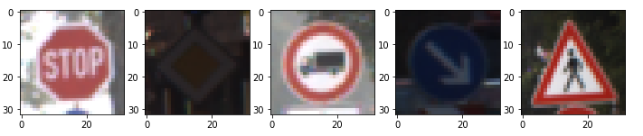
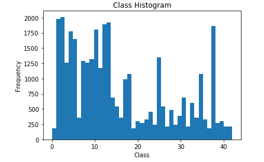
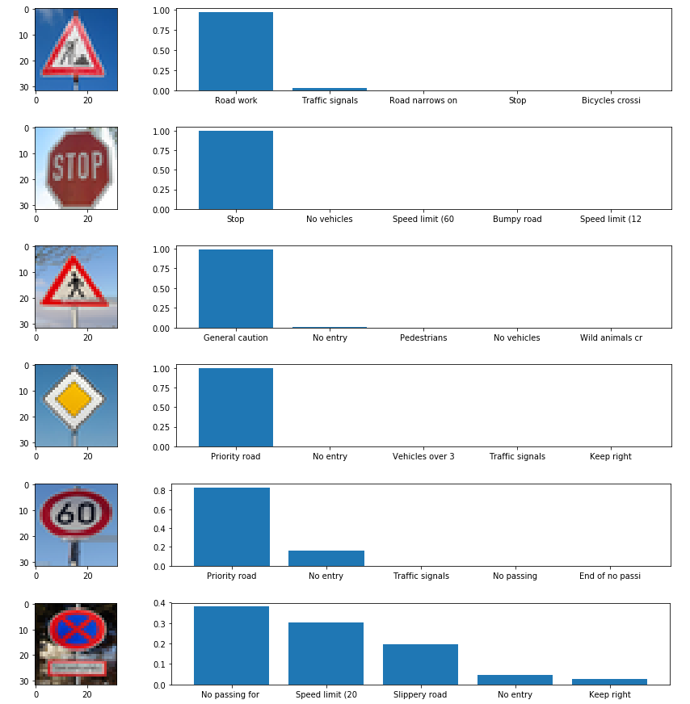
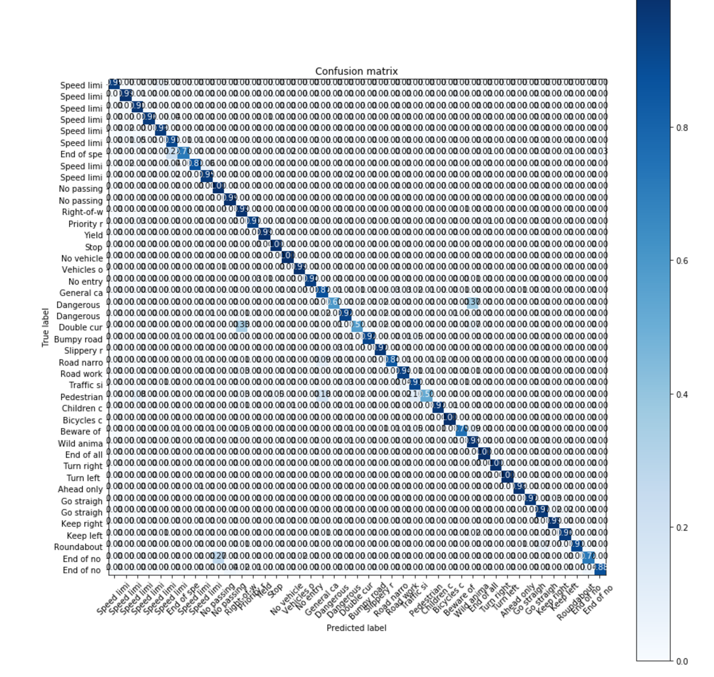
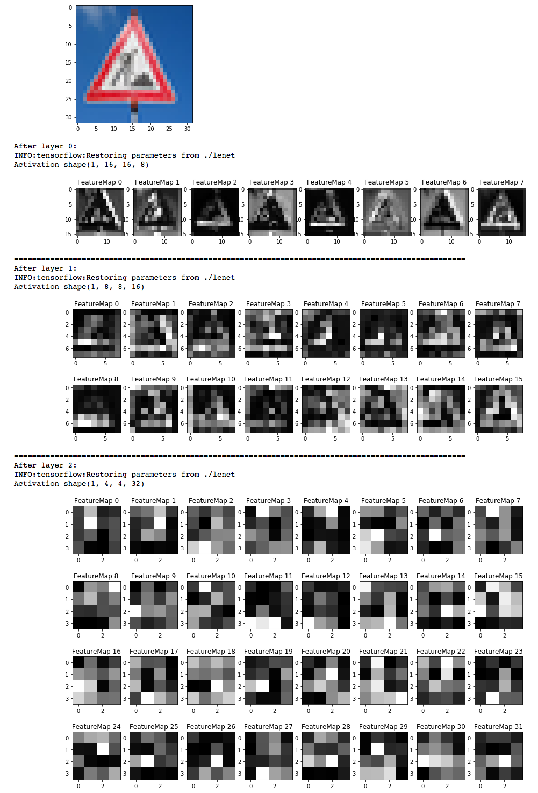

# **Traffic Sign Recognition**

**See Traffic_Sign_Classifier_BN.iynb for final submission.**


[//]: # (Image References)

[image1]: ./examples/visualization.jpg "Visualization"
[image2]: ./examples/grayscale.jpg "Grayscaling"
[image3]: ./examples/random_noise.jpg "Random Noise"
[image4]: ./images/no_entry.jpg "Traffic Sign 1"
[image5]: ./images/pedestrian.jpg "Traffic Sign 2"
[image6]: ./images/priority.jpg "Traffic Sign 3"
[image7]: ./images/road_word.jpg "Traffic Sign 4"
[image8]: ./images/Stop_sign.jpg "Traffic Sign 5"

---
## Introduction

Understanding traffic signs is a key issue for self driving cars which has to share the road with other human drivers. The aim of this project is given a set of _cropped_ traffic signs to classify them into its traffic sign category.

### Data Set Summary &  Exploration
There are 34799 images to train on of size 32x32x3. Each data point (pixel) ranges from `[0,255]`. The test set contains 12630 images with same dimensionality. There are 43 classes in which these images originate from. The data is collected in varying light conditions making the problem slightly more difficult. A sample of 5 images is shown below:



There seems to be a class imbalance of the dataset as shown in the chart below.




### Preprocessing

The RGB images were normalised such that it's mean was 0 and standard deviation 1. The mean and standard deviations were calculated from the train data set. No other pre processing or data augmentation was carried out.

This preprocessing step is important as it ensures that the gradient information is kept small, ensuring that large steps in the direction of gradients is avoided.

### Model Architecture
#### First Models:
The initial model consisted of a Basic LeNet Architecture, which was two convolutional blocks (5x5 convolution -> Relu -> MaxPool) followed by two Dense layers. The problem with this model was that its accuracy seemed to saturate at 82% when using Batch size of 256.

Increasing it to 3 convolutional blocks increased the accuracy to 84%.

#### Final Model:
My final model consisted of the following layers:

| Layer         		|     Description	        					|
|:---------------------:|:---------------------------------------------:|
| Input         		| 32x32x3 RGB image   							|
| Convolution Block     	| 1x1 stride, same padding, outputs 16x16x8 	|
| Convolution Block     	| 1x1 stride, same padding, outputs 8x8x16 	|
| Convolution Block     	| 1x1 stride, same padding, outputs 4x4x32 	|
| Convolution Block     	| 1x1 stride, same padding, outputs 2x2x64 	|
| Flatten					|												|
| Dense Block	| 128 Nodes 				|
| Dense	    | `n_classes`	|
| Softmax				|    									||

The Convolution Block consisted of the following:
- A 3x3 kernel model.
- Batch Normalisation.
- Leaky Relu
- A 3x3 kernel model.
- Batch Normalisation.
- Leaky Relu
- A 2x2 Max Pooling with a stride of 2.

The convolution followed by activation was repeated twice as shown in the dot points above. This structure was **inspired by the VGG16 model**.

Similarly the Dense Block (apart from the very last `Dense`) layer contained Batch Normalisation before the activation.

Leaky relu was defined to be: `max(0.1x, x)`.

### Design Decisions
- **Stacking Conv Layers**:
We chose to stack two 3x3 layers as this gave an effective receptive field of 5x5, the same as used in LeNet.
- **Leaky Relu**:
Since the gradient for an input less than zero for a ReLu activation is zero, this may lead to the problem of 'dead' neurons, where that particular weight may stall in the learning process. Leaky ReLu, circumvents this problem by having a non-zero gradient for intputs less than zero.
- **Batch Normalisation**:
This was used as somewhat of a regularisation technique. Since the 'message' that is passed through layers can get amplified due to the multiplication of many weights, the gradient information that comes through back propagation may also be large. By 'normalizing' (so that the mean is zero and standard deviation of one) the inputs that get passed onto the activation layer, side steps this issue.
- **Batch Size**:
The batch size turned out to be an important step in the training process. Initially a batch size of 256 was chosen. This lead to saturation of the accuracy at 90% at 200 epochs. However, choosing a batch size of 128, lead to an accuracy of 90% being achieved at 60 epochs. This is most probably due to the fact that gradient information would have been random with a smaller batch size leading to better exploration of the parameter space.

### Training
A batch size of 128 was used along with an `RMS Prop` optimizer and was trained for 200 epochs. The learning rate was set at 0.001. Larger batch sizes slowed down the training in that it took longer to reach a 93% accuracy (despite the fact that per batch running time decreased slightly).

It was important to update the training as follows:
```
update_ops = tf.get_collection(tf.GraphKeys.UPDATE_OPS)
with tf.control_dependencies(update_ops):
    optimizer = tf.train.RMSPropOptimizer(learning_rate = rate)
    training_operation = optimizer.minimize(loss_operation)
```
This is due to the fact that batch normalization required the summary statistics to be updated between batches of data being fed into the graph.

My final model results were:
* validation set accuracy of 93.6%
* test set accuracy of 94.7%


### Test Images from Web
Here are five German traffic signs that I found on the web:



In comparison to the dataset downloaded for this assignment, these images are not necessarily centred (see especially the 60km/h speed limit). The images are all taken in bright conditions.

The accuracy is 50% in using these test images, with 66.6% top 5 accuracy. This is in comparison to 94.7% accuracy in the test set suggesting that there may have been overfitting.

The confusion matrix on the test set shows that there are some classes that needs further training before being used in production. Some as low as 50% accuracy.


### Visualizing the Neural Network

