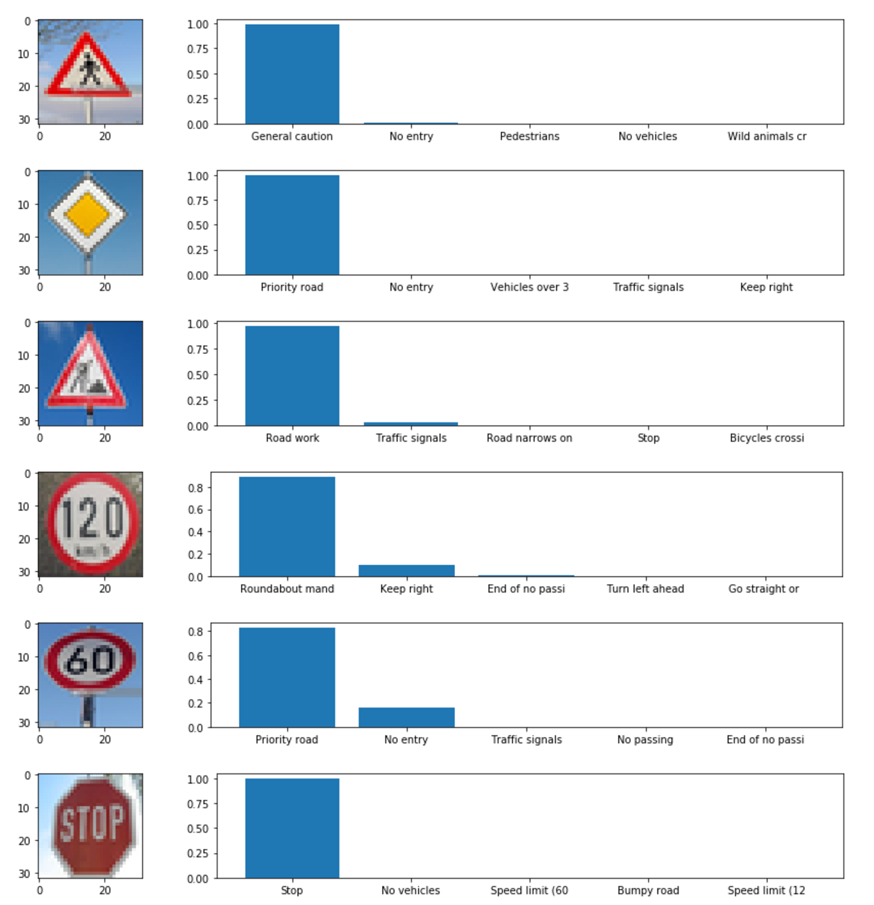

# **Traffic Sign Recognition**

**See Traffic_Sign_Classifier_BN.iynb for final submission.**


[//]: # (Image References)

[image1]: ./examples/visualization.jpg "Visualization"
[image2]: ./examples/grayscale.jpg "Grayscaling"
[image3]: ./examples/random_noise.jpg "Random Noise"
[image4]: ./images/no_entry.jpg "Traffic Sign 1"
[image5]: ./images/pedestrian.jpg "Traffic Sign 2"
[image6]: ./images/priority.jpg "Traffic Sign 3"
[image7]: ./images/road_word.jpg "Traffic Sign 4"
[image8]: ./images/Stop_sign.jpg "Traffic Sign 5"

---
## Introduction

Understanding traffic signs is a key issue for self driving cars which has to share the road with other human drivers. The aim of this project is given a set of _cropped_ traffic signs to classify them into its traffic sign category.

### Data Set Summary &  Exploration
There are 34799 images to train on of size 32x32x3. Each data point (pixel) ranges from `[0,255]`. The test set contains 12630 images with same dimensionality. There are 43 classes in which these images originate from. The data is collected in varying light conditions making the problem slightly more difficult. A sample of 5 images is shown below:


There seems to be a class imbalance of the dataset as shown in the chart below.


### Preprocessing

The RGB images were normalised such that it's mean was 0 and standard deviation 1. The mean and standard deviations were calculated from the train data set. No other pre processing or data augmentation was carried out.


### Model Architecture

My final model consisted of the following layers:

| Layer         		|     Description	        					|
|:---------------------:|:---------------------------------------------:|
| Input         		| 32x32x3 RGB image   							|
| Convolution Block     	| 1x1 stride, same padding, outputs 16x16x8 	|
| Convolution Block     	| 1x1 stride, same padding, outputs 8x8x16 	|
| Convolution Block     	| 1x1 stride, same padding, outputs 4x4x32 	|
| Convolution Block     	| 1x1 stride, same padding, outputs 2x2x64 	|
| Flatten					|												|
| Dense Block	| 128 Nodes 				|
| Dense	    | `n_classes`	|
| Softmax				|    									||

The Convolution Block consisted of the following:
- A 3x3 kernel model.
- Batch Normalisation.
- Leaky Relu
- A 3x3 kernel model.
- Batch Normalisation.
- Leaky Relu
- A 2x2 Max Pooling with a stride of 2.

The convolution followed by activation was repeated twice as shown in the dot points above. This structure was **inspired by the VGG16 model**.

Similarly the Dense Block (apart from the very last `Dense`) layer contained Batch Normalisation before the activation.

Leaky relu was defined to be: `max(0.1x, x)`.

### Training
A batch size of 128 was used along with an `RMS Prop` optimizer and was trained for 200 epochs. The learning rate was set at 0.001. Larger batch sizes slowed down the training in that it took longer to reach a 93% accuracy (despite the fact that per batch running time decreased slightly).

It was important to update the training as follows:
```
update_ops = tf.get_collection(tf.GraphKeys.UPDATE_OPS)
with tf.control_dependencies(update_ops):
    optimizer = tf.train.RMSPropOptimizer(learning_rate = rate)
    training_operation = optimizer.minimize(loss_operation)
```
This is due to the fact that batch normalization required the summary statistics to be updated between batches of data being fed into the graph.

My final model results were:
* validation set accuracy of 93.6%
* test set accuracy of 94.7%


### Test Images from Web
Here are five German traffic signs that I found on the web:



The 3rd, 5th and 6th images had a hard time classifying the image. The 5th image infact did not even contain the class in the top 5. The accuracy in this case is 50%.

### Visualizing the Neural Network

